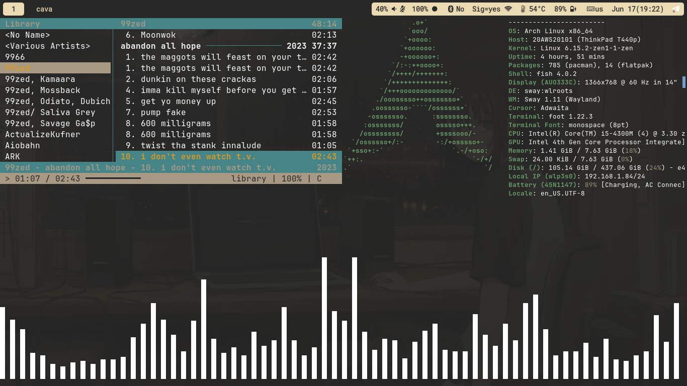
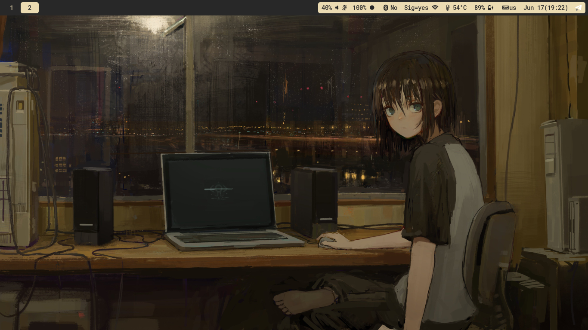
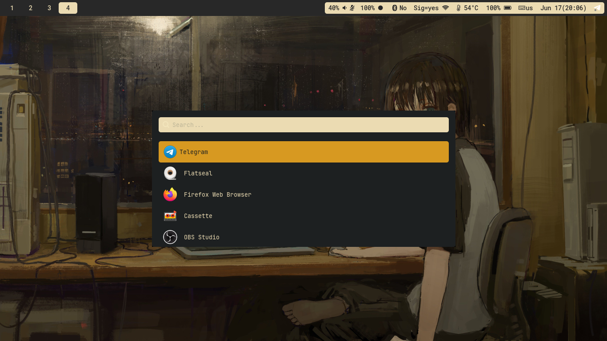

# Введение 
Самый крутой конфиг в мире на сваи (неа, его надо пилить и пилить, но с пивком потянет).
Основано на арче + sway (не удивительно в целом). Конфиг это сборная солянка из других конфигов, конфиг больше пилился под 1366x768 экран без дополнительных дисплеев, так что увы, дальше придётся самим ручками его допиливать если что-то не будет работать. (И вот по этому у меня Sig=yes/no и блютуз с Yes/No, оно просто обрезается и выглядит плохо).   
## Что там по софту основному
Тема - `Gruvbox`   
Браузер - `Firefox`  
Терминал - `Foot`  
Видео + Аудио - `VLC`  
Бар - `Waybar`  
Меню приложений - `Wofi`  
Настройка wifi - `nmtui`  
Аудиосистема - `Pipewire`  
Проводник или Файловый менеджер - `Nemo`  
Музыка - `Выберете сами cmus или musikcube или ещё что то`  
Просмотр фотографий - `Gwenview`  
Скриншоты - `Flameshot`  
__ОЧЕНЬ ВАЖНАЯ ДЕТАЛЬ: ФЕТЧ__ - `fastfetch + hyfetch`    
### Что надо допилить и мне лень
1. права доступа, типо то что в USR вылазить или когда программе надо от рута запустится где то (я не помню чесно как называется)
2. добавить GUI проводник
3. допилить GTK и libadwaita тему (но я туплю)
4. QT проги (как в 3 пункте)
5. возможно бар
6. надо убирать bluetooth с waybar при отсутствии такого модуля на материнской плате
#### Так как это поставить?  
Установить эти пакеты ниже (список что я стаивл для рача, рачка, арча. В целом можно отдельно сразу это всё ставить и должно заработать, для этого я вынесу в отдельный файл).
```
sway swayidle swaybg vlc pavucontrol blueberry pipewire-alsa alsa-utils unzip ttf-nerd-fonts-symbols ttf-jetbrains-mono waybar xorg libnotify wl-clipboard pipewire-pulse ly xdg-desktop-portal xdg-desktop-portal-gtk xdg-desktop-portal-wlr go wofi foot wayland pipewire git gnu-free-fonts noto-fonts ttf-bitstream-vera fish ttf-croscore ttf-dejavu ttf-droid ttf-ibm-plex ttf-input ttf-input-nerd ttf-liberation ttf-roboto firefox brightnessctl wireplumber mako firefox bluez bluez-utils ttf-linux-libertine  ttf-indic-otf swaylock htop gwenview nemo flameshot gtk-engine-murrine gtk-engines
```

Так же из AUR лучше поставить (для устаовки тем для QT):  
```
qt6ct-kde qt5ct-kde
```

Насрано но должно работать.  
Потом скопировать конфиги или просто `git clone` и всё копирнуть из .config в .config каталоге пользователя.  

Flatpak тему я беру от Fausto-Korpsvart/Gruvbox-GTK-Theme
и что бы вы не тупили как я то ниже команды которые надо вписать что бы тема рименилась когда вы поставите:  
```
sudo flatpak override --filesystem=$HOME/.themes
```

```
sudo flatpak override --filesystem=xdg-config/gtk-4.0
```

Ну и можно сразу доступ к иконкам дать:

```
sudo flatpak override --filesystem=$HOME/.icons
```

Включение сервиса блютуза с его запуском сейчас же:

```
sudo systemctl enable --now bluetooth
```

> знали бы как я себя чувствовал когда гитом пользовался через терминал...
  
##### Фоточки?
  
  
и фото 2
  
  
  
и фото wofi  
  
  
  
###### Развитие дотов?
Буду ли я его доделывать?  
Я не знаю. Если у меня будет желание использовать арч с тайлингом, то да. Но, у меня больше желания быть как один человек (это не оскорбление, а реальный человек) и использовать Slackware + Windows нежели Arch Linux (мне просто арч как то не заходил всегда).
