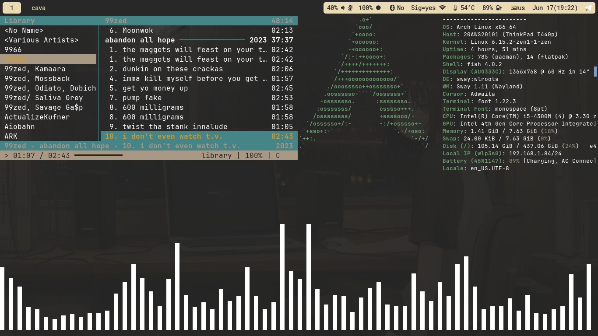
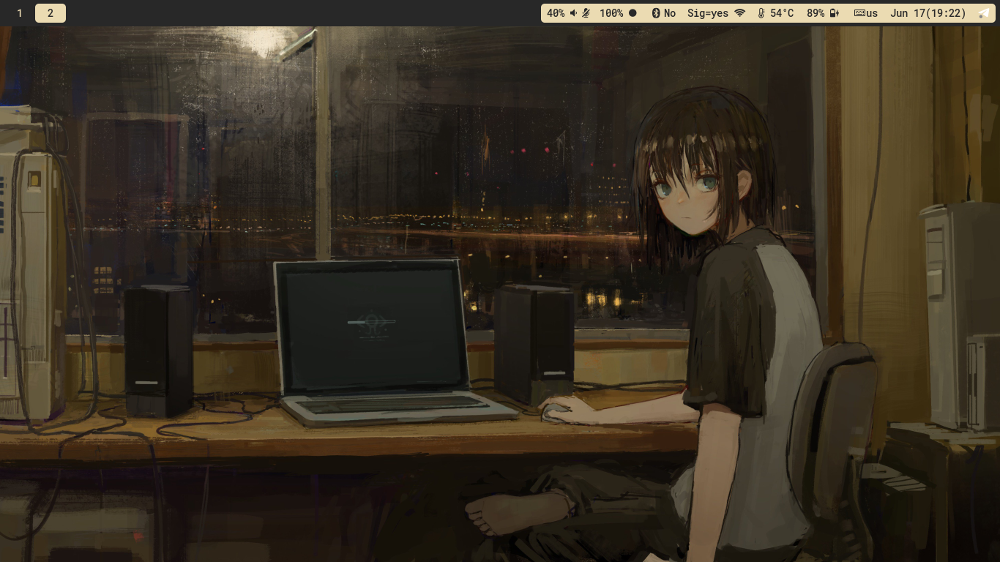
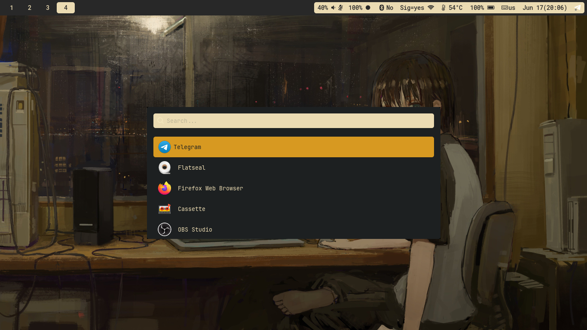

# Введение 
Самый крутой конфиг в мире на сваи (неа, его надо пилить и пилить, но с пивком потянет).
Основано на арче + sway (не удивительно в целом). Конфиг это сборная солянка из других конфигов, конфиг больше пилился под 1366x768 экран без дополнительных дисплеев, так что увы, дальше придётся самим ручками его допиливать если что-то не будет работать. (И вот по этому у меня Sig=yes/no и блютуз с Yes/No, оно просто обрезается и выглядит плохо).
А так же, хочу сказать заранее что я лох в дотах и это моё первое документирование того чего я сделал и +- нормально сделанные доты).

## Что там по софту основному
Тема - `Gruvbox`   
Тема GTK - [`Gruvbox-GTK-Theme`](https://github.com/Fausto-Korpsvart/Gruvbox-GTK-Theme)  
Иконки - [`Papirus`](https://github.com/PapirusDevelopmentTeam/papirus-icon-theme)  
Браузер - `Firefox`  
Терминал - `Foot`  
Видео + Аудио - `VLC`  
Бар - `Waybar`  
Меню приложений - `Wofi`  
Настройка wifi - `nmtui`  
Аудиосистема - `Pipewire`  
Проводник или Файловый менеджер - `Nemo`  
Музыка - Выберете сами `cmus` или `musikcube` или ещё что-то  
Просмотр фотографий - `Gwenview`  
Скриншоты - `Flameshot`  
PDF файлы - `zathura`  
Уведомления - `mako`  

### Что надо допилить и мне лень
1. Polkitd
2. тему для QT
3. возможно бар
4. надо убирать bluetooth с waybar при отсутствии такого модуля на материнской плате
#### Так как это поставить?  
Установить эти пакеты ниже (список что я стаивл для рача, рачка, арча. В целом можно отдельно сразу это всё ставить и должно заработать, для этого я вынесу в отдельный файл).
```
sway swayidle swaybg vlc pavucontrol blueberry pipewire-alsa alsa-utils unzip ttf-nerd-fonts-symbols ttf-jetbrains-mono waybar xorg libnotify wl-clipboard pipewire-pulse ly xdg-desktop-portal xdg-desktop-portal-gtk xdg-desktop-portal-wlr go wofi foot wayland pipewire git gnu-free-fonts noto-fonts ttf-bitstream-vera fish ttf-croscore ttf-dejavu ttf-droid ttf-ibm-plex ttf-input ttf-input-nerd ttf-liberation ttf-roboto firefox brightnessctl wireplumber mako firefox bluez bluez-utils ttf-linux-libertine  ttf-indic-otf swaylock htop gwenview nemo flameshot gtk-engine-murrine gtk-engines zathura
```

## Насилие QT ради тёмной темы:  
```
 sudo pacman -S qt5-wayland qt6-wayland qt6ct qt5ct
```
Далее я в 
```
/etc/environment
```
вписал 
```
QT_QPA_PLATFORMTHEME=qt5ct
```
и перезагрузил, тёмная тема, мне уже достаточно 
> (maybe можно без /etc/environment, но я скилл ишью)


Насрано но должно работать.  
Потом скопировать конфиги или просто `git clone` и всё копирнуть из .config в .config каталоге пользователя.  

Flatpak тему я беру от [Fausto-Korpsvart/Gruvbox-GTK-Theme](https://github.com/Fausto-Korpsvart/Gruvbox-GTK-Theme), сочитается тема оч так себе, но я другой особо не нашел (плохо искал, и это мне выдал SearXNG, но ведь всегда можно форкнуть).

```
sudo flatpak override --filesystem=$HOME/.themes
```

```
sudo flatpak override --filesystem=xdg-config/gtk-4.0
```

Ну и можно сразу доступ к иконкам дать:

```
sudo flatpak override --filesystem=$HOME/.icons
```

Включение + запуск Bluetooth:

```
sudo systemctl enable --now bluetooth
```

> знали бы как я себя чувствовал когда гитом пользовался через терминал...
  
# Фоточки?
  
  
и фото 2
  
  
  
и фото wofi  
  
  


###### Че то надо делать
спустя год вроде, решил опять поставить
проблема с flameshot в виде 

```flameshot: warning: Если настройка useGrimAdapter не включена, будет использоваться протокол DBus. Следует отметить, что использование протокола DBus в Wayland не рекомендуется. Рекомендуется включить настройку useGrimAdapter в файле flameshot.ini, чтобы активировать общий адаптер снимков экрана Wayland на основе Grim / flameshot: error: Не удалось захватить экран / flameshot: error: Не удалось захватить экран / QLayout: Attempting to add QLayout "" to SidePanelWidget "", which already has a layout / flameshot: info: Screenshot aborted.```    

p.s. пометка в виде ```/``` это типо перенос текста за ним на следющую строку, да

воот

решается в ``` ~/.config/flameshot/flameshot.ini```
надо добавить две строки что бы работало нормально

```
useGrimAdapter=true
disabledGrimWarning=true
```
ну и в целом должно работать (у меня так)
  

